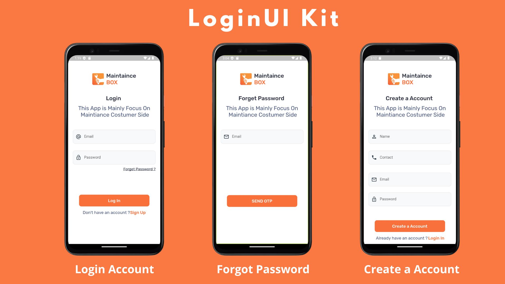

# 🖥 login_Screen_UI
<<<<<<< HEAD

=======

>>>>>>> 25ff5dc4c9a5db144454cc20c901412d0f7eba16

A new Flutter project. 
This project is all about designing and Implimenting Code to get Login Screen with a modern UI using the latest features offered by Flutter. In a total of three parts we will create a unique background using Flutter and Dart, design appealing input fields for the best user experience and include eye-caching UI for a smooth feeling In this Project basically Three  design UI Screen.

- Login Screen
- Forgot Password Screen
- Create a Account

## Color Reference

| Color             | Hex                                                                |
| ----------------- | ------------------------------------------------------------------ |
| Outrageous Orange |  #ff6633 |
| White |  #FFFFFF |
| Blacl |  #000000 |

## Getting Started

This project is a starting point for a Flutter application.

A few resources to get you started if this is your first Flutter project:

- [Lab: Write your first Flutter app](https://docs.flutter.dev/get-started/codelab)

<<<<<<< HEAD
=======
## 🔗 Social Links

>>>>>>> 25ff5dc4c9a5db144454cc20c901412d0f7eba16

- [Cookbook: Useful Flutter samples](https://docs.flutter.dev/cookbook)

For help getting started with Flutter development, view the
[online documentation](https://docs.flutter.dev/), which offers tutorials,
samples, guidance on mobile development, and a full API reference.

## 🔗 Social Links

