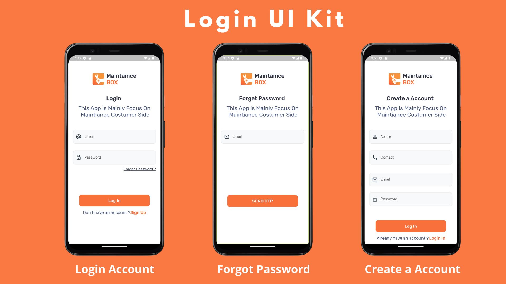
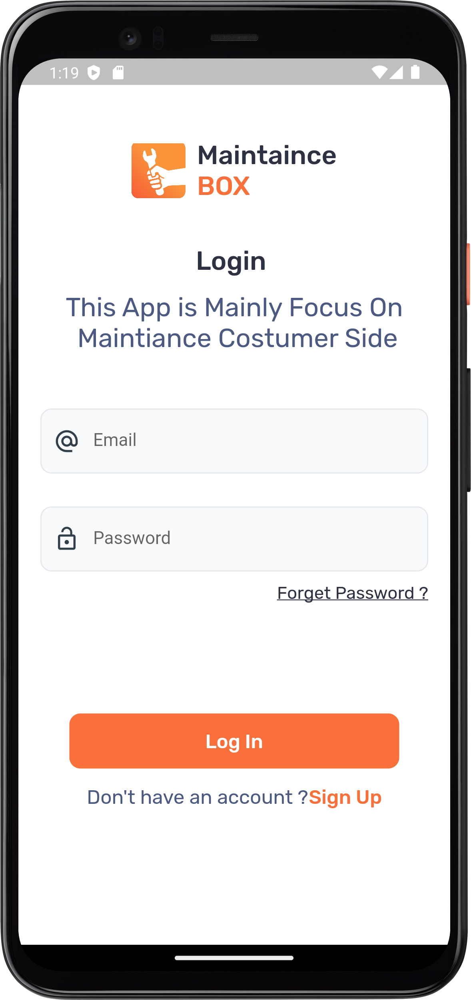
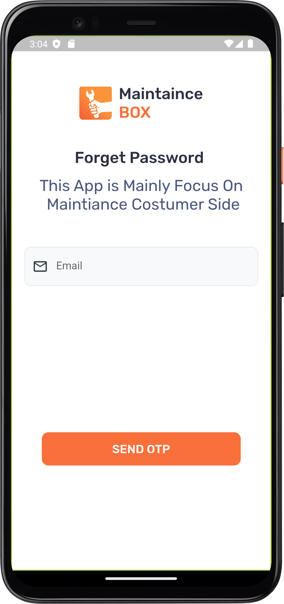
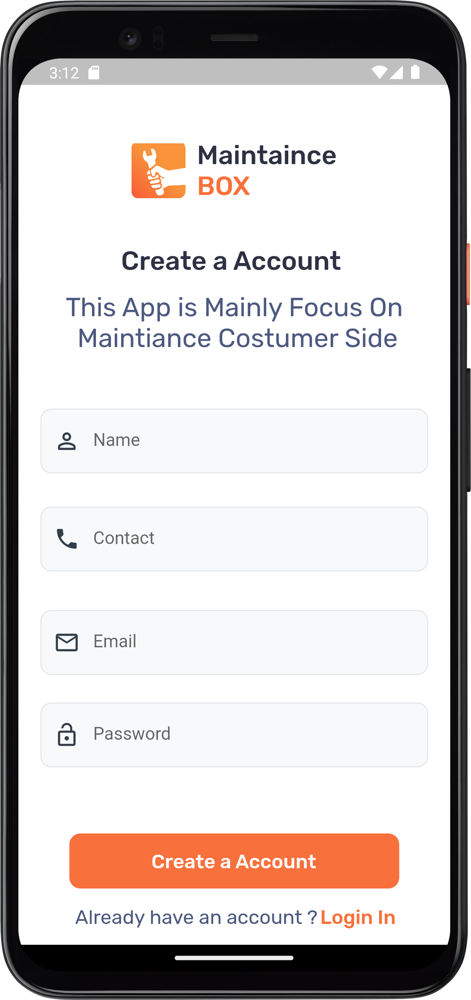

<<<<<<< HEAD
# login_Screen_UI

A new Flutter project. 
This project is all about designing and Implimenting Code to get Login Screen with a modern UI using the latest features offered by Flutter. In a total of three parts we will create a unique background using Flutter and Dart, design appealing input fields for the best user experience and include eye-caching UI for a smooth feeling In this Project basically Three  design UI Screen.

# Screenshots

## Login Screen

- 

## Forget Password
- 

## Create a Account Screen

- 
=======
# login_Screen_ui

>>>>>>> 4a5138d0651563caf36f72019b042d3bac160e9e

## Getting Started

This project is a starting point for a Flutter application.

A few resources to get you started if this is your first Flutter project:

- [Lab: Write your first Flutter app](https://docs.flutter.dev/get-started/codelab)
- [Cookbook: Useful Flutter samples](https://docs.flutter.dev/cookbook)

For help getting started with Flutter development, view the
[online documentation](https://docs.flutter.dev/), which offers tutorials,
samples, guidance on mobile development, and a full API reference.
